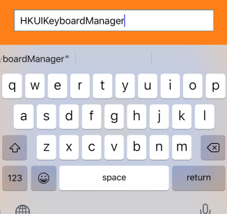
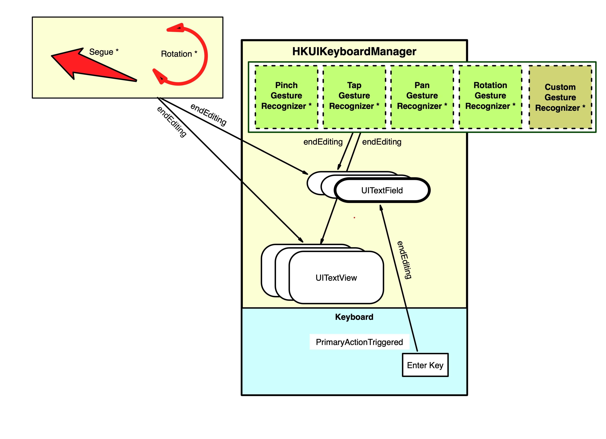
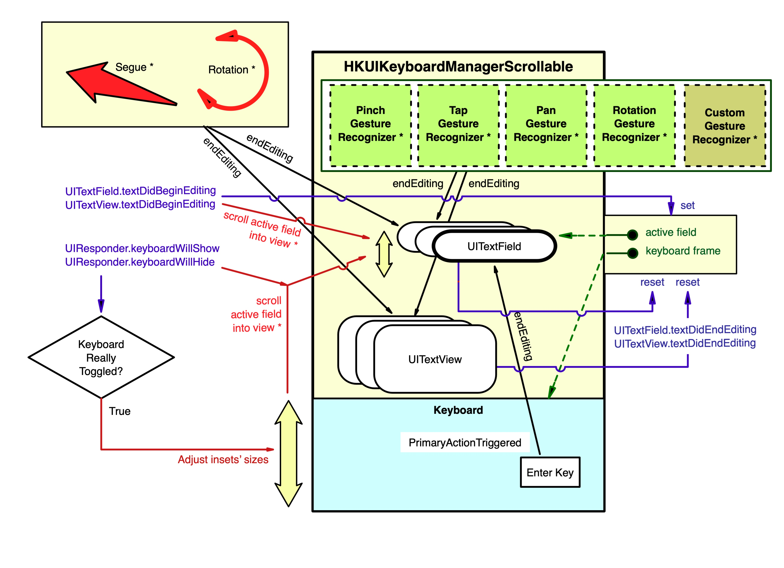

#  HKUIKeyboardManager #
    
#### Harrison Kong's UI Keyboard Manager ####




## VERSION HISTORY ##

1.0.0 - 2020/01/18 - Initial release

## MINIMUM REQUIREMENTS ##

**Swift** 5.0 or above

**iOS** 13.0 or above


## WHAT IS IT? ##

Showing and hiding the on-screen keyboard is always a headache in mobile application development. So much code and they are all over different places in the project. And you have to do it in every project.

This keyboard manager will come to your rescue and provide many options to customize how its function. Only a few lines of code will saves you hours of work in every project that uses text input. It also provides a few bonus functions.

To see it in action and play with its options, head to https://github.com/harrisonkong/HKUIKeyboardManagerDemo for this demo application.

  

The following diagrams here explain how it works.

There are two classes, `HKUIKeyboardManager` is for `UIView` that do not scroll. For this version, it simply hides and shows the keyboard.



Another one `HKUIKeyboardManagerScrollable` is for `UIScrollView` and descendants such as `UICollectionView` and `UITableView`. For this verison, it is also capable or scrolling the active text field into better view as well as adding inset to the content behind it so that the user can scroll to what's behind the keyboard.



It works by keeping track of a list of UITextFields or UITextViews (or their descendants) that you register with it. And it also use a few gesture recognizers to capture taps and other gestures (They do not interfere with other gesture recognizers that you might need to use in your code). It is then able to tell all the editable fields to end editing when taps are detected outside of any text fields and views, resulting in hiding of the keyboard. Hitting the enter key on single line text fields (UITextFields) will also hide the keyboard.

In addition, for the scrollView version, it also has an option (default is enabled) to scroll the active text field into the optimal view when it is tapped.


## HOW TO INSTALL IT ##

Use one of the following methods:

### 1. Using CocoaPod ###

The module is avabilable via CocoaPods Trunk. Below is an example podfile. If you already use a podfile for your project, all you have to do is add the line that specifies `HKUIButton`. The other dependencies will also be automatically installed in the xcworkspace.

```
platform :ios, '13.0'

target 'MyTarget' do

  use_frameworks!

  pod 'HKUIKeyboardManager', '~> 1.0.0'
  # other pods for your project

end
```

Don't forget to import it first if you are using the CocoaPod option:

```
import HKUIKeyboardManager
```

### 2. BY INCLUDING THE SOURCE FILES ###

You can also simply include the following source files in your project:

```
HKUIKeyboardManager.swift
HKUIKeyboardManagerScrollable.swift
UIView+HKUtilities.swift
```


## HOW TO USE IT ##

### 1. Initialize and register text fields ###
    
```
 
let kbManager : HKUIKeyboardManagerScrollable?
.
.
.

override func viewDidLoad() {
 super.viewDidLoad()

   // code ...

   kbManager = HKUIKeyboardManager.init(ownerView: scrollView, outermostView: view)

   kbManager?.registerEditableField(nameTextField)
   kbManager?.registerEditableField(addressTextField)

  // more code ...

}
        
```

(Optional Steps:)
 
### 2. Call from the overridden prepare if you want to hide the keyboard when seguing to another screen (dismissDuringSegue == true) ###
  
```
override func prepare(for segue: UIStoryboardSegue, sender: Any?) {

    // some code ...

    KBManager?.preparingSegue()

   // some other code ...
}

```

### 3. Call from the overridden viewWillTransition if you want to hide the keyboard during device rotation (dismissDuringDeviceRotation == true) ###

```
override func viewWillTransition(to size: CGSize, with coordinator: UIViewControllerTransitionCoordinator) {

  super.viewWillTransition(to: size, with: coordinator)

  // do whatever ...

  KBManager?.viewWillTransition()
}
```

### 4. If you would like the keyboard to be dismissed upon custom gestures, register your own custom gesture recognizers. You can add additional action targets for these gesture recognizers but do not add them to any views or assign delegates to them. The keyboard manager will handle that. ###
    
```
 .
 .
tripleTapRecognizer.addTarget(self, action: #selector(handle3Taps(_:)))
KBManager?.registerCustomGestureRecognizer(tripleTapRecognizer)
 .
 .
       
```
 
### 5. Change other user options as needed: ###

      option                      default     meaning for true
      ______________________________________________________________________
 
      dismissOnTapGestures        true        if taps are detected outside
                                              of keyboard and not in text
                                              fields, keyboard will dismiss
 
      dismissOnPanGestures        true        if pans are detected outside
                                              of keyboard and not in text
                                              fields, keyboard will dismiss
 
                                  false       (set to false by default for
                                              HKUIKeyboardManagerScrollable to
                                              allow scrolling)

      dismissOnPinchGestures      true        if pinches are detected outside
                                              of keyboard and not in text
                                              fields, keyboard will dismiss
 
      dismissOnRotationGestures   true        if rotation gestures are detected
                                              outside of keyboard and not in
                                              text fields, keyboard will dismiss
 
      dismissDuringSegue          true        dismiss the keyboard when a segue
                                              is being prepared, only set to
                                              false if the view does not rotate.
                                              Subject to automatically setting
                                              to true if the view rotates and
                                              this is set to false.
                                              See development notes.
 
      dismissDuringDeviceRotation true        dismiss the keyboard when the
                                              device is rotated, only set to
                                              false if the view does not segue
                                              to another screen.
                                              Subject to automatically setting
                                              to true if a segue is prepared and
                                              this is set to false.
                                              See development notes.
 
      keepActiveFieldInViews      true        (HKUIKeyboardManagerScrollable
                                              only)
                                              if the active text field is
                                              obscured by the keyboard when it
                                              first receive focus, it will be
                                              scrolled to above the keyboard
                                              
                                              but if doing so will cause the
                                              top of the field to extend above
                                              the top of the screen, it will
                                              simply be scrolled down so that
                                              its top is just under the top of
                                              the screen with a small margin.
                               


## TO CUSTOMIZE IT ##

If you are interested in modifying the code, please read the development notes in a separate file for issues that you should be aware of.


## KNOWN ISSUES ##

There are no known issues currently.
     
